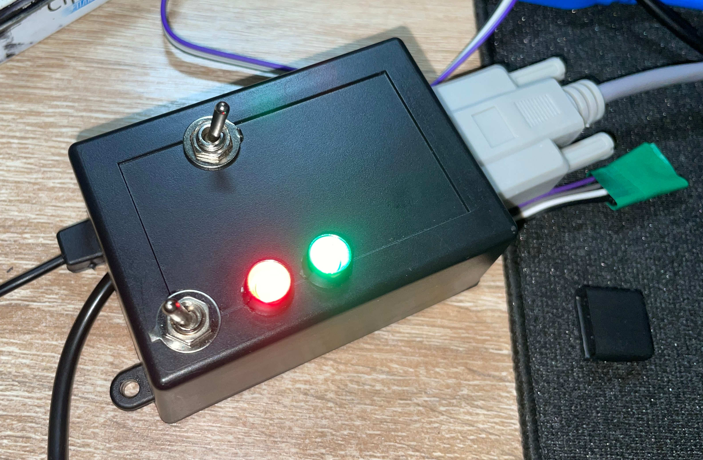
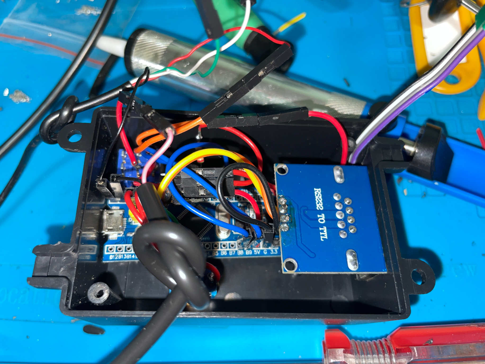
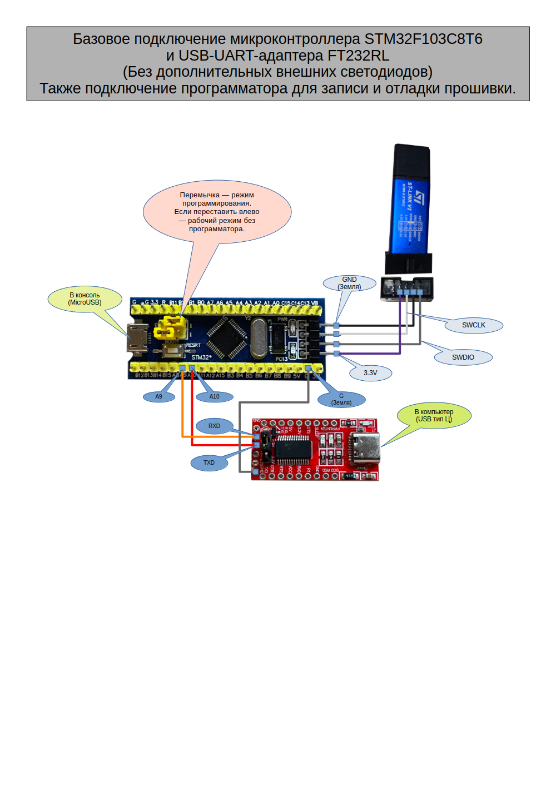
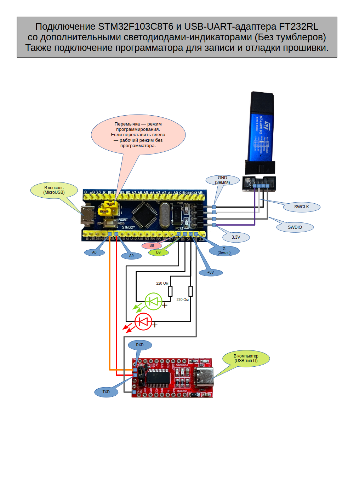
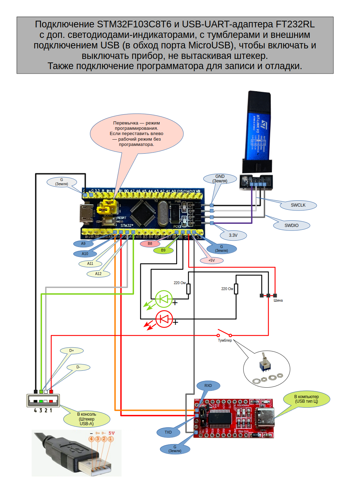
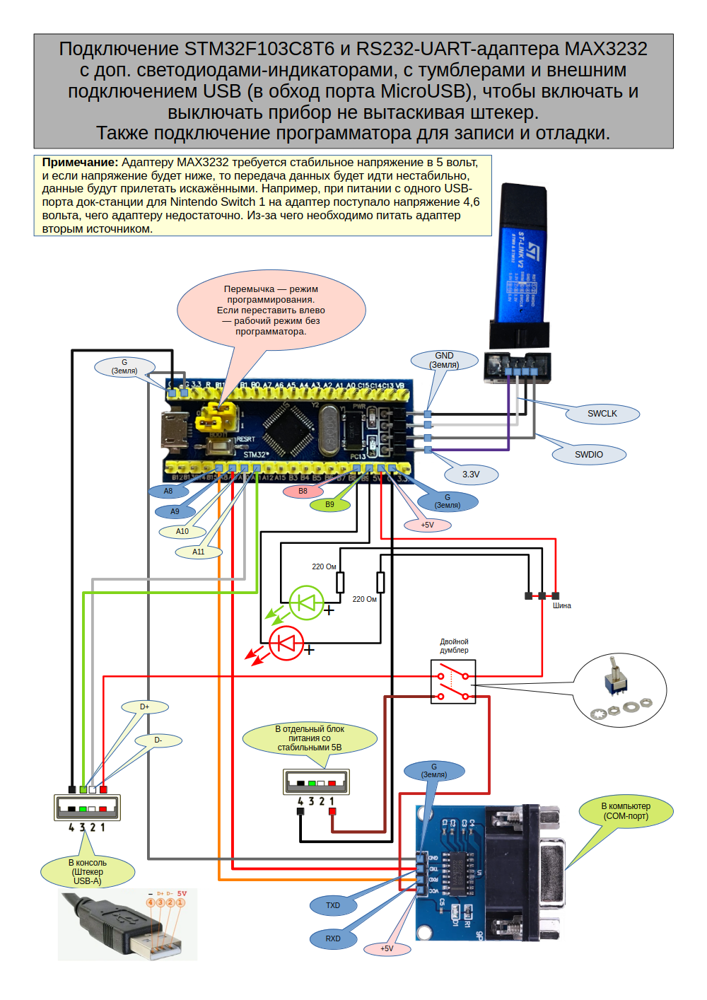

# Адаптер игрового управления USB-HID через RS232 для Nintendo® Switch™ (1/2)

Это самодельный адаптер на основе микроконтроллера STM32F103C8T6 "Blue pill",
который с одной стороны общается с компьютером через UART-канал (либо через
адаптер USB-UART, либо через RS232-UART по типу MAX3232). А с другой стороны
данный адаптер имитирует протокол USB-HID игрового контроллера Nintendo® Switch™
Pro Controller.

Прошивка в данном репозитории собирается с помощью комплекта разработки
STM32CubeIDE, который можно [загрузить на сайте разработчика](https://www.st.com/en/development-tools/stm32cubeide.html) под Linux, Windows и macOS (если из России, нужно использовать иностранный прокси-сервер, либо загрузить [копию с зеркала](https://disk.yandex.ru/d/Bbc-1A_Erti0NA)).

Для связи с устройством требуется [программа-клиент](/Wohlstand/NXUSB-UART-Client).

## Устройство в сборе

# Сборка адаптера

## Требуется
- **Сам микроконтроллер STM32F103C8T6 "Blue Pill"** (данный проект совместим только с ним, под другие нужно отдельно выполнять отладку). Можно, например, приобрести здесь: https://ozon.ru/t/TOwhRgw, либо в любом другом месте.
- **Программатор STLink V2** (Без него будет невозможно зашить прошивку на микроконтроллер). Я покупал здесь: https://ozon.ru/t/3QJVuKr
- MicroUSB-кабель для подключения микроконтроллера к игровой консоли или другому компьютеру.
- **Любой USB-UART адаптер** для базовой схемы. Я покупал FT232RL: https://ozon.ru/t/1fz5M92
  - Кабель USB-Type-C для подключения FT232RL, может не пригодится, если адаптер USB-UART будет выполнен в виде штекера USB-A. Тогда можно взять какой-нибудь USB-удлинитель для удобства подключения.
- Паяльник, чтобы припаять ножки к плате микроконтроллера.
- Набор проводов-перемычек для макетных плат. Например: https://ozon.ru/t/wE8mMSH
- **По желанию:**
  - **Если хочется светодиодов:**
    - Светодиоды на 3~5 вольт, зелёный и красный, примерно на 3 миллиметра.
    - Резисторы на 220 ом, обязательно должны быть в цепи со светодиодом дабы не допустить их быстрый вывод их строя.
  - **Если хочется вывести отдельный USB-кабель**
    - Четырёх-жильный кабель для USB. Либо можно из сломанных устройств (мышей, клавиатур) откусить провода со штекерами (главное, чтобы были 4-х-жильные!).
    - USB-штекер типа A для пайки, если выбран путь создания своего кабеля, а не использования донорских запчастей.
    - Тумблер на одну цепь (можно и на две, но использовать только одну): https://ozon.ru/t/MncfFZi
  - **Если хочется использовать RS232-UART вместо USB-UART:**
    - Адаптер MAX3232. Например: https://ozon.ru/t/zLGocck
    - Нужно создать второй USB-кабель и нужен тумблер с двумя цепями.
    - Нужен COM-удлинитель (RS-232 9M-9F - папа-мама), иначе будет проблематично подсоединить плату к компьютеру. Например https://ozon.ru/t/UufEW5f
  - **Пластиковый корпус**, если хочется упаковать самоделку внутрь (можно взять любой, какой удобно, я лично брал этот: https://ozon.ru/t/Axt4PSy )

# Схемы

## Базовый вариант и USB-UART

Самый простой вариант, какой можно собрать практически без пайки, не считая
припаивания гребёнок на плату микроконтроллера, которые обычно поставляются
отсоединёнными.

## Базовый вариант с USB-UART и светодиодными-индикаторами

Немного улучшенный вариант с добавленными светодиодными индикаторами.

## Продвинутый вариант с USB-UART с использованием внешнего кабеля

В данном варианте вместо использования штатного MicroUSB-порта подсоединён
внешний USB-кабель, а также организован тумблер для возможности включать-выключать
устройство не вытаскивая шнур из консоли.

## Альернативный продвинутый вариант с использованием адаптера RS232-UART

Данный вариант похож на предыдущий, но вместо USB-UART используется адаптер RS232,
который позволит подключить к COM-порту компьютера вместо использования USB.

Данный вариант особенен тем, что требуется два USB-штекера, второй для отдельного
стабильного питания модуля MAX3232. Можно запитать и с общего USB-кабеля от консоли,
но, в некоторых случаях адаптеру не будет хватать напряжения, и из-за чего данные
будут прилетать с сильными повреждениями. Потому требуется либо вывести отдельное
питание, либо чтобы общий источник был достаточно мощным, чтобы не было необходимости
занижать напряжение.

